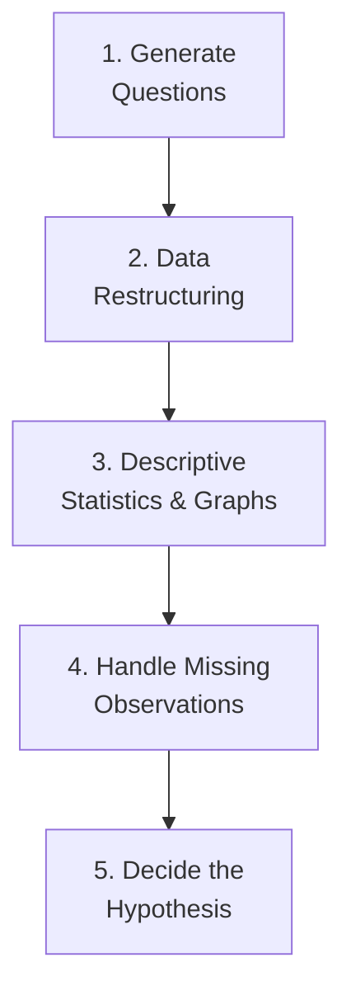

# Exploratory Data Analysis (EDA)

> EDA is the process of investigating a dataset to discover patterns, spot anomalies, test hypotheses, and check assumptions — typically using summary statistics and visualizations.

---

## Table of Contents

- [Objectives](#objectives)
- [EDA Workflow](#eda-workflow)
- [Classification of EDA Methods](#classification-of-eda-methods)
- [Data Types](#data-types)
- [Data Visualization](#data-visualization)
- [Quick Recap](#quick-recap)

---

## Objectives

- **Extract important features** — identify which variables matter most
- **Find outliers and anomalies** — spot data points that don't fit the pattern
- **Test underlying assumptions** — verify if the data meets the assumptions required by your models (e.g., normality, linearity)

---

## EDA Workflow

| Step | Description |
|------|-------------|
| **1. Generate questions** | What do you want to learn from this data? |
| **2. Data restructuring** | Reshape, rename, reformat data so it's ready for analysis |
| **3. Descriptive statistics & graphs** | Use numerical summaries (mean, median, std) and charts to understand distributions |
| **4. Handle missing observations** | Decide whether to drop, impute, or flag missing values |
| **5. Decide the hypothesis** | Formulate a claim that can be tested through experimentation |

> **Note:** A hypothesis is a claim that can be proved (or disproved) by experiment. EDA helps you form better hypotheses before formal testing.

---

## Classification of EDA Methods

| Method | Description | Examples |
|--------|-------------|----------|
| **Graphical (Diagrammatic)** | Visual representations of data | Histograms, scatter plots, box plots |
| **Non-Graphical (Calculational)** | Numerical summaries and statistics | Mean, median, standard deviation, correlation |

### By Number of Variables

| Type | Description |
|------|-------------|
| **Univariate** | Analyze one variable at a time — understand its distribution, central tendency, spread |
| **Multivariate** | Explore 2+ variables together — find relationships, correlations, interactions |

> **Tip:** Start with univariate analysis to understand each variable individually, then move to multivariate to see how they relate.

---

## Data Types

| Type | Description | Example |
|------|-------------|---------|
| **Continuous** | Numeric values on a scale | Age: 10, 20, 60 |
| **Categorical** | Discrete groups/classes | Age group: child, teen, old |

### Categorical Subtypes

| Subtype | Description | Example |
|---------|-------------|---------|
| **Nominal** | Categories with no natural order | Color: red, blue, green |
| **Ordinal** | Categories with a meaningful order | Rating: low < medium < high |

---

## Data Visualization

Choosing the right chart depends on the data type and what you want to show.

| Chart | Best For | Data Type |
|-------|----------|-----------|
| **Bar chart** | Comparing categories | Categorical |
| **Histogram** | Showing distribution of continuous data (binned into categories) | Continuous (binned) |
| **Scatter plot** | Relationship between two continuous variables | Continuous |
| **Correlation heatmap** | Pairwise correlations across many continuous variables | Continuous (matrix) |
| **Pie chart** | Showing proportions of a whole | Categorical |

> ⚠️ **Verify:** Your original notes listed "bar chart" under continuous data. Bar charts are typically used for categorical data, while histograms handle continuous data. The table above reflects the standard convention — confirm this matches your course material.

> **Common Mistake:** Don't use pie charts when you have more than 5-6 categories — it becomes hard to compare slices. Use a bar chart instead.

---

## Quick Recap

- **EDA Goals:** Extract key features, find outliers, test assumptions
- **Workflow:** Generate questions → Restructure data → Descriptive stats & graphs → Handle missing data → Form hypothesis
- **Methods:** Graphical (visual) vs. Non-Graphical (numerical); Univariate (one variable) vs. Multivariate (2+ variables)
- **Data Types:** Continuous (numeric) vs. Categorical (nominal/ordinal)
- **Visualization:** Match chart type to data type — bar/pie for categorical, histogram/scatter/heatmap for continuous
