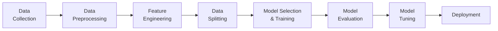

# ML Pipeline

> A machine learning pipeline is the end-to-end process of taking raw data and turning it into a deployed, usable model.

---

## Table of Contents

- [Pipeline Overview](#pipeline-overview)
- [1. Data Collection](#1-data-collection)
- [2. Data Preprocessing](#2-data-preprocessing)
- [3. Feature Engineering](#3-feature-engineering)
- [4. Data Splitting](#4-data-splitting)
- [5. Model Selection](#5-model-selection)
- [6. Evaluation Metrics](#6-evaluation-metrics)
- [7. Model Tuning](#7-model-tuning)
- [Key Terms](#key-terms)
- [Quick Recap](#quick-recap)

---

## Pipeline Overview

---

## 1. Data Collection

**Sources:** websites, IoT, databases, papers

**Methods to collect:**

- **API** — pull structured data from web services
- **OCR** — extract text from images/PDFs
- **RPA** (Robotic Process Automation) — automate repetitive data entry tasks
- **Web Scraping** — extract data directly from web pages

**Repositories to store data:**

| Type | Use Case |
|------|----------|
| SQL databases | Structured, relational data |
| NoSQL databases | Unstructured or semi-structured data |
| Data warehouse | Aggregated historical data for analysis |
| Data lake | Raw data at any scale (structured + unstructured) |

---

## 2. Data Preprocessing

| Step | Description |
|------|-------------|
| **Cleaning** | Handle missing values, remove duplicates, fix errors |
| **Integration** | Merge data from multiple sources into one dataset |
| **Transform** | Make all data in the same format (e.g., Excel, CSV, PDF → uniform schema) |
| **Reduction** | Remove unnecessary data (drop irrelevant columns, reduce dimensionality) |

---

## 3. Feature Engineering

Creating useful input features from raw data. This is often where the biggest performance gains come from.

| Technique | What it does |
|-----------|--------------|
| **Creation** | Build new features from existing ones (e.g., `age` → `age_group`) |
| **Transformation** | Apply math/logical ops (log, binning, encoding) |
| **Extraction** | Pull features from unstructured data (e.g., text → word count) |
| **Selection** | Pick the most relevant features, drop the rest |
| **Scaling** | Normalize/standardize features so they're on comparable scales |

> **Tip:** Feature engineering is often more impactful than model selection. A simple model with great features can beat a complex model with raw features.

---

## 4. Data Splitting

| Split | Purpose | Typical Size |
|-------|---------|--------------|
| **Training set** | Model learns from this data | 60–70% |
| **Validation set** | Tune hyperparameters, check for overfitting | 15–20% |
| **Test set** | Final, unbiased evaluation of model performance | 15–20% |

> ⚠️ **Verify:** Your original notes listed "testing 30%" and "validation 30%" which would total 130%. The table above shows a standard 3-way split. Make sure you're using the split that matches your course material.

> **Common Mistake:** Never touch the test set during training or tuning. It should only be used once at the very end to get an honest performance estimate.

---

## 5. Model Selection

### Based on Data

| Factor | Options |
|--------|---------|
| **Type** | Structured (tables) vs. Unstructured (images, text, audio) |
| **Size** | Small dataset → simpler models; Large dataset → complex models |
| **Quality** | Missing values, noise, and outliers affect which models are robust enough |

### Based on Task

| Task | Example |
|------|---------|
| **Classification** | Spam vs. not spam |
| **Regression** | Predicting house prices |
| **Clustering** | Customer segmentation |
| **Anomaly Detection** | Fraud detection |
| **Time Series** | Stock price forecasting |

---

## 6. Evaluation Metrics

### Confusion Matrix

|  | **Predicted Positive** | **Predicted Negative** |
|--|------------------------|------------------------|
| **Actual Positive** | True Positive (TP) | False Negative (FN) |
| **Actual Negative** | False Positive (FP) | True Negative (TN) |

### Key Metrics

| Metric | Formula | What it measures |
|--------|---------|------------------|
| **Precision** | TP / (TP + FP) | Of all predicted positives, how many are actually positive? |
| **Recall** | TP / (TP + FN) | Of all actual positives, how many did we catch? |
| **F1-Score** | 2 × (Precision × Recall) / (Precision + Recall) | Harmonic mean — balances precision and recall |
| **AUC-ROC** | Area under the ROC curve | Overall ability to distinguish between classes |

> **Note:** Use **precision** when false positives are costly (e.g., spam filter marking real email as spam). Use **recall** when false negatives are costly (e.g., missing a cancer diagnosis).

---

## 7. Model Tuning

Adjusting **hyperparameters** (settings the model doesn't learn on its own) to improve performance.

Common hyperparameters:

- **Learning rate** — how big each update step is
- **Epochs** — how many times the model sees the full training data
- **Optimizer** — the algorithm used to update weights (e.g., SGD, Adam)

**Techniques:** Cross-validation, grid search, random search

---

## Key Terms

| Term | Definition |
|------|------------|
| **Underfitting** | Model is too simple — captures neither the pattern nor the noise. High bias. |
| **Overfitting** | Model memorizes the training data including noise. Good training accuracy, poor test accuracy. High variance. Often happens with big models and small data. |
| **Bias** | Error from wrong assumptions in the model (e.g., assuming a straight line for curved data). |
| **Variance** | Error from sensitivity to small fluctuations in training data. Model is too sensitive to the specific data it trained on. |

> **Tip:** The bias-variance tradeoff is central to ML. Simple models → high bias, low variance. Complex models → low bias, high variance. The goal is to find the sweet spot.

---

## Quick Recap

- **ML Pipeline:** Collection → Preprocessing → Feature Engineering → Splitting → Model Selection → Evaluation → Tuning → Deployment
- **Data Collection:** Sources include APIs, OCR, RPA, web scraping; store in SQL/NoSQL, warehouses, or data lakes
- **Preprocessing:** Clean, integrate, transform, reduce
- **Feature Engineering:** Create, transform, extract, select, scale — often the biggest lever for performance
- **Data Splitting:** Train (60-70%), Validation (15-20%), Test (15-20%) — never touch test during training
- **Model Selection:** Depends on data type/size/quality and the task (classification, regression, clustering, anomaly detection, time series)
- **Evaluation:** Confusion matrix → precision, recall, F1, AUC-ROC; choose metric based on cost of FP vs FN
- **Model Tuning:** Adjust hyperparameters (learning rate, epochs, optimizer) using cross-validation
- **Key Tradeoff:** Bias vs. variance — underfitting (high bias) vs. overfitting (high variance)
