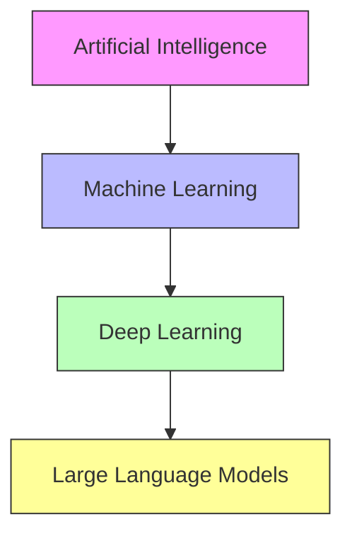
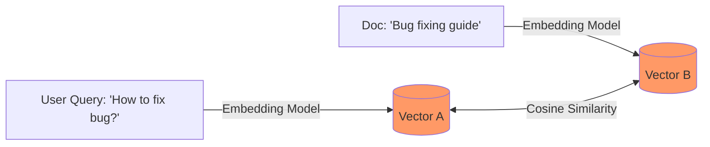
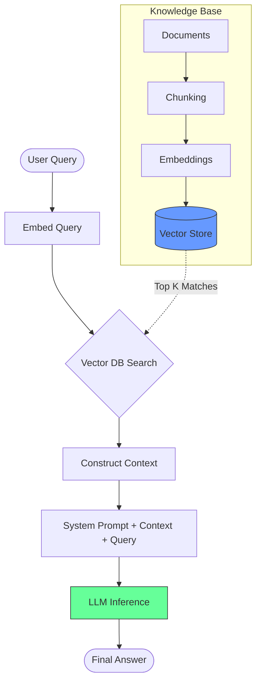
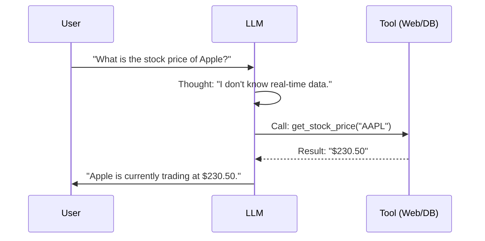

# RAG & AI Engineering Guide

## 1. AI Fundamentals Hierarchy

Understanding where RAG fits in the broader landscape is crucial.

### Key Terminology

- **Tokens**: The atomic units of processing. Not exactly words (e.g., "smart" + "er"). ~0.75 words.
- **Context Window**: The maximum memory buffer (in tokens) the model has for the current conversation.

### Learning Paradigms

- **Zero-Shot**: Asking the model to perform a task without examples. (Relies on pre-training).
- **Few-Shot**: Providing 2-3 examples in the prompt to guide the output format or logic.

---

## 2. Embeddings & Vector Search

The engine behind RAG. An **Embedding** is a conversion of text into a vector (a list of floating-point numbers) that represents distinct semantic meaning.

### The Process

1.  **Model**: Use tools like **Ollama** (`nomic-embed-text`) or OpenAI (`text-embedding-3`).
2.  **Math**: Text is mapped to a multi-dimensional space.
3.  **Search**: We find "nearest neighbors" to key concepts.

### Cosine Similarity

The standard metric for "related confidence". It measures the angle between vectors.

- **1.0**: Identical meaning.
- **0.0**: Unrelated.

---

## 3. RAG Architecture (Retrieval-Augmented Generation)

RAG bridges the gap between a frozen LLM and your private, dynamic data.

---

## 4. Prompt Engineering & Control

### System Prompt

The "Instruction Layer". This is the high-priority first message that defines constraints.

- **Goal**: Prevent external knowledge hallucinations.
- **Example**: "You are a helpful assistant. You strictly answer ONLY using the provided context."

### Temperature (Creativity)

Controls the randomness of token selection.

- **Low (0.0 - 0.2)**: Deterministic, factual. **Crucial for RAG** to prevent hallucination.
- **High (0.8 - 1.0)**: Creative, varied. Good for brainstorming.

---

## 5. Agentic Workflows & Tools

Modern AI isn't just a chatbot; it's an agent that acts.

### Chain of Thought (CoT)

Encouraging the model to "think silently" or explain steps before answering improves complex reasoning.

### Tool Use Pattern

The model acts as a router. It assesses the query, decides a tool is needed, executes it, and synthesizes the result.

---

## 6. Advanced Developer Concepts

| Concept          | Description                                                 | Why it matters                                          |
| :--------------- | :---------------------------------------------------------- | :------------------------------------------------------ |
| **Chunking**     | Splitting large docs into smaller pieces (Fixed, Semantic). | Too large = noise; Too small = missing context.         |
| **Re-ranking**   | A second pass to sort retrieved vectors by relevance.       | drastically improves accuracy.                          |
| **Vector DBs**   | Specialized DBs (Pinecone, Milvus, Chroma).                 | Optimized for handling millions of vectors efficiently. |
| **Quantization** | Reducing model weights (fp16 -> int4).                      | Runs large models on consumer hardware (Mac/Laptop).    |
