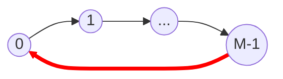

# C++ Competitive Programming Handbook

## 1. Type Conversion and Arithmetic

In C++, when an operation allows operands of different data types, the compiler automatically converts the "lower" ranking data type to the "higher" one before checking the calculation. This is known as **Implicit Type Conversion** or **Type Promotion**.

### Type Hierarchy (Lowest to Highest)

1. `char` / `short`
2. `int`
3. `long int`
4. `long long int`
5. `float`
6. `double`
7. `long double`

**Rule:** If one operand is a higher type (e.g., `double`), the other operand (e.g., `int`) is promoted to `double`, and the result will be a `double`.

```cpp
#include <iostream>
using namespace std;

int main() {
    cout << 7 / 2;      // Output: 3 (Integer division)
    cout << 7 / 2.0;    // Output: 3.5 (Float division)
    cout << 'c' + 1;    // Output: 100 ('c' promotes to int 99)
    return 0;
}
```

---

## 2. Time Complexity & Constraints

In competitive programming, the input size ($N$) determines the valid time complexity for your solution. A general rule of thumb is that a standard C++ server can perform $\approx 10^8$ operations per second.

```mermaid
graph TD
    subgraph "Complexity Hierarchy"
    O1[O(1) - Constant] --> OlogN[O(log N) - Binary Search]
    OlogN --> ON[O(N) - Linear]
    ON --> ONlogN[O(N log N) - Sorting/Maps]
    ONlogN --> ON2[O(N^2) - Nested Loops]
    ON2 --> OExp[O(2^N) - Recursion]
    end

    style O1 fill:#9f9,stroke:#333
    style OlogN fill:#bfb,stroke:#333
    style ON fill:#dfd,stroke:#333
    style ONlogN fill:#ffd,stroke:#333
    style ON2 fill:#fba,stroke:#333
    style OExp fill:#f99,stroke:#333
```

| Input Constraint ($N$) | Target Complexity       | Example Algorithm                    |
| :--------------------- | :---------------------- | :----------------------------------- |
| $N \le 10^{18}$        | $O(1)$ or $O(\log N)$   | Math, Binary Exponentiation          |
| $N \le 10^5$           | $O(N)$ or $O(N \log N)$ | Two Pointers, Sorting, Binary Search |
| $N \le 5000$           | $O(N^2)$                | DP, Simple Graphs                    |
| $N \le 20$             | $O(2^N)$                | Bitmask DP, Brute Force Recursion    |

---

## 3. Choosing the Right Data Structure (STL)

Selecting the correct container is crucial for performance. Use this decision tree:

```mermaid
flowchart TD
    Start([Start]) --> KV{Key-Value Pair?}

    KV -- Yes --> Order{Order Matters?}
    Order -- Yes --> Map[Map <br/> Search: O(log N)]
    Order -- No --> UMap[Unordered Map <br/> Search: O(1)]

    KV -- No --> Unique{Unique Elements?}
    Unique -- Yes --> Order2{Order Matters?}
    Order2 -- Yes --> Set[Set <br/> Search: O(log N)]
    Order2 -- No --> USet[Unordered Set <br/> Search: O(1)]

    Unique -- No --> Access{Access Pattern?}
    Access -- Random Access --> Vector[Vector <br/> O(1) access]
    Access -- Front/Back --> Deque[Deque]
    Access -- LIFO --> Stack[Stack]
    Access -- FIFO --> Queue[Queue]
    Access -- Priority --> PQ[Priority Queue]

    style Start fill:#f9f,stroke:#333,stroke-width:2px
    style Map fill:#bbf,stroke:#333
    style UMap fill:#bbf,stroke:#333
    style Set fill:#bfb,stroke:#333
    style Vector fill:#fbf,stroke:#333
```

---

## 4. Modulo Arithmetic

When answers can be very large (e.g., $10^9 + 7$), you must perform calculations modulo $M$ at every step to avoid integer overflow.

**The Modulo Cycle:**
Modulo arithmetic wraps around like a clock.



**Essential Properties:**

1.  **Addition:** `(a + b) % m = ((a % m) + (b % m)) % m`
2.  **Multiplication:** `(a * b) % m = ((a % m) * (b % m)) % m`
3.  **Subtraction:** `(a - b) % m = ((a % m) - (b % m) + m) % m` **(Crucial: Add m)**

```cpp
long long a = 10^12;
long long m = 10^9 + 7;

// Safe multiplication
long long result = ((a % m) * (a % m)) % m;
```
