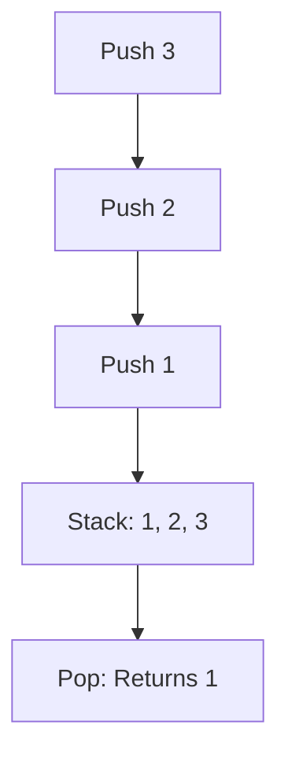
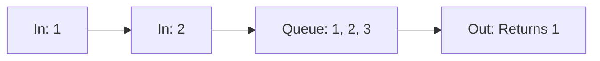
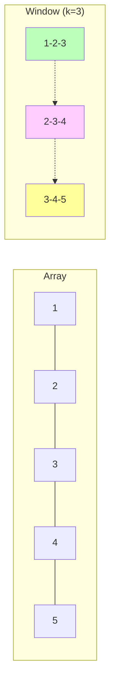
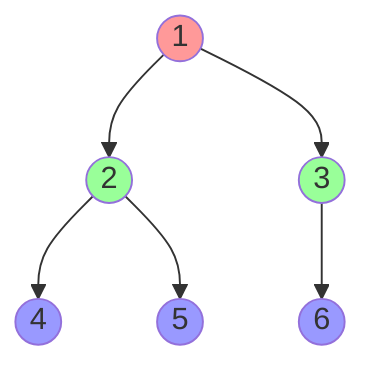
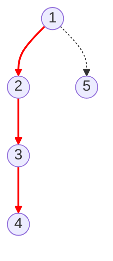

# C++ Standard Template Library (STL) Guide

## 1. Containers Overview

The STL provides a set of widely used classes for data structures.

| Container         | Type           | Order        | Duplicates? | Underlying Struct | Search Complexity | Use Case                          |
| :---------------- | :------------- | :----------- | :---------- | :---------------- | :---------------- | :-------------------------------- |
| **Vector**        | Dynamic Array  | Insertion    | Yes         | Array             | $O(N)$ (scan)     | Default list, fast random access. |
| **Map**           | Key-Value Pair | Sorted (Key) | No (Keys)   | Red-Black Tree    | $O(\log N)$       | Key-based lookup, sorted keys.    |
| **Unordered Map** | Key-Value Pair | Random       | No (Keys)   | Hash Table        | $O(1)$ (avg)      | Fast lookups, order doesn't fail. |
| **Set**           | Key Only       | Sorted       | No          | Red-Black Tree    | $O(\log N)$       | Unique constraints, sorted data.  |
| **Unordered Set** | Key Only       | Random       | No          | Hash Table        | $O(1)$ (avg)      | Fast uniqueness check.            |
| **Stack**         | Adapter (LIFO) | LIFO         | Yes         | Deque/Vector      | $O(1)$ (top)      | DFS, Backtracking.                |
| **Queue**         | Adapter (FIFO) | FIFO         | Yes         | Deque/List        | $O(1)$ (front)    | BFS, Scheduling.                  |

---

## 2. Pairs & Vectors

### Pairs

Used to maintain a simple relation between two pieces of data.

```cpp
pair<int, string> p = {2, "abc"};
cout << p.first << " " << p.second;
```

### Vectors

Dynamic arrays with contiguous memory.

```cpp
vector<int> v;
v.push_back(10);          // Add to end: O(1)
v.pop_back();             // Remove from end: O(1)
int sz = v.size();        // O(1)

// Initialization
vector<int> v1(5, 0);     // Size 5, filled with 0
vector<int> v2 = v1;      // Deep Copy: O(N)

// 2D Vectors
vector<vector<int>> grid;
grid.push_back({1, 2, 3});
```

---

## 3. Maps & Sets (Ref-Black Trees)

### Maps `map<key, value>`

Sorted by keys. Good for frequency counting or when order matters.

```cpp
map<int, string> m;
m[1] = "abc";             // Insertion: O(log N)
auto it = m.find(1);      // Lookup: O(log N)

if(it != m.end()) {
    cout << it->second;
}

m.erase(1);               // Deletion: O(log N)
```

### Sets `set<key>`

Stores unique elements in sorted order.

```cpp
set<string> s;
s.insert("apple");        // O(log N)
bool exists = s.count("apple"); // 1 if found, 0 if not
```

---

## 4. Unordered Containers (Hash Tables)

Use when order implies no value and speed is critical.
**Note:** Does not support complex types (pairs/vectors) as keys by default.

```cpp
unordered_map<int, string> um; // O(1) avg
unordered_set<int> us;         // O(1) avg
```

---

## 5. Stacks & Queues

### Stack (LIFO: Last-In, First-Out)

Think of a stack of plates.



```cpp
stack<int> st;
st.push(1);
st.top(); // Returns 1
st.pop(); // Removes 1
```

### Queue (FIFO: First-In, First-Out)

Think of a line at a store.



```cpp
queue<int> q;
q.push(1);
q.front(); // Returns 1
q.pop();   // Removes 1
```

---

## 6. Advanced Competitive Programming Concepts

### Prefix Sums (Visualization)

To calculate range sums in $O(1)$ after $O(N)$ preprocessing.

**Array ($A$):** `[ 3, 1, 4, 1, 5 ]`
**Prefix ($P$):** `[ 3, 4, 8, 9, 14 ]`

Query Sum(L, R) = $P[R] - P[L-1]$

Query(1, 3) (indexes 1 to 3: 1+4+1 = 6):
$P[3] (9) - P[0] (3) = 6$.

### Sliding Window Technique

Efficiently finding subarrays.



- **Objective:** Maintain a window of size $K$.
- **Move:** Remove element at `i-k`, add element at `i`.
- **Complexity:** $O(N)$ instead of $O(N \cdot K)$.

### Graph Traversal Visualization (BFS vs DFS)

**BFS (Breadth-First Search)** - Level by Level (Shortest Path in unweighted graph)



**DFS (Depth-First Search)** - Deep Dive (Backtracking, Pathfinding)


