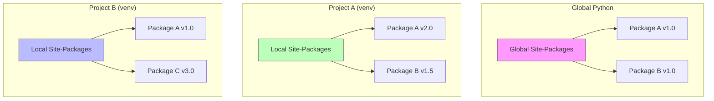

# Python Virtual Environments & Competitive Programming Guide

## 1. Virtual Environments (venv)

A **Internal Virtual Environment** is a self-contained directory tree that contains a Python installation for a particular version of Python, plus a number of additional packages.

### Why use `venv`?

It prevents dependency conflicts. One project might need `Django 2.0` while another needs `Django 4.0`. Installing everything globally causes chaos.



### Commands

| Action         | Windows (Cmd/PowerShell)      | macOS / Linux (Bash/Zsh)       |
| :------------- | :---------------------------- | :----------------------------- |
| **Create**     | `python -m venv env_name`     | `python3 -m venv env_name`     |
| **Activate**   | `.\env_name\Scripts\activate` | `source env_name/bin/activate` |
| **Deactivate** | `deactivate`                  | `deactivate`                   |
| **Install**    | `pip install <package>`       | `pip3 install <package>`       |

## 2. Dependency Management

To share your project, you need to list its dependencies.

### Freezing Dependencies

Saves all currently installed packages to a file.

```bash
pip freeze > requirements.txt
```

### Installing from Requirements

Installs all packages listed in the file.

```bash
pip install -r requirements.txt
```

---

## 3. Python for Competitive Programming

While `venv` is for development, mastering Python's standard library is crucial for CP. Python is slower than C++, so optimization is key.

### Fast I/O Template

The standard `input()` and `print()` are slow for massive I/O ($N > 10^5$). Use `sys`.

```python
import sys

# Fast Input
input = sys.stdin.readline

def solve():
    # Read integer
    n = int(input())
    # Read array
    arr = list(map(int, input().split()))

    # Fast Output
    sys.stdout.write(str(sum(arr)) + '\n')

if __name__ == '__main__':
    solve()
```

### Essential Libraries (Visualized)

```mermaid
mindmap
  root((Python CP Libs))
    Collections
      deque (O(1) popleft)
      Counter (Frequency map)
      defaultdict
    Heapq
      heappush (Min Heap)
      heappop
    Itertools
      permutations
      combinations
      product
    Bisect
      bisect_left (Binary Search)
      insort
    Math
      gcd
      lcm
      factorial
    Sys
      setrecursionlimit
```

### Time Complexity & PyPy

- **CPython**: Standard interpreter. Good for simple tasks.
- **PyPy**: JIT (Just-In-Time) compiled. Significantly faster for loops and arithmetic. **Always submit with PyPy** if available on platforms like Codeforces.

| Operation                  | Python List | C++ Vector |
| :------------------------- | :---------- | :--------- |
| **Append**                 | $O(1)$      | $O(1)$     |
| **Pop**                    | $O(1)$      | $O(1)$     |
| **Insert/Delete (Middle)** | $O(N)$      | $O(N)$     |
| **Search**                 | $O(N)$      | $O(N)$     |
| **Hash Map Access**        | $O(1)$      | $O(1)$     |

### Example: Priority Queue (Min-Heap)

Python's `heapq` implements a min-heap by default.

```python
import heapq

pq = []
heapq.heappush(pq, 5)
heapq.heappush(pq, 1)
heapq.heappush(pq, 10)

print(heapq.heappop(pq)) # Output: 1 (Smallest element)
```
